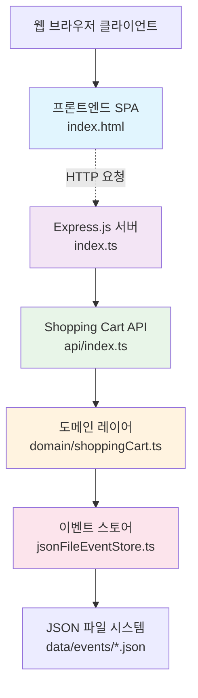
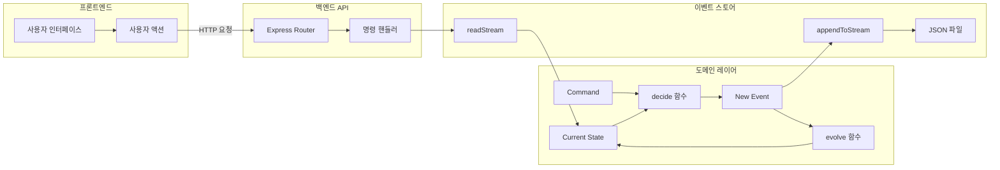

# 프론트엔드-서버 아키텍처 관계도

# ref

- https://event-driven-io.github.io/emmett/getting-started.html

## 전체 시스템 아키텍처



## API 엔드포인트 및 함수 매핑

### 1. 쇼핑카트 관리 API

| HTTP Method | 엔드포인트                        | 프론트엔드 함수                       | 백엔드 핸들러                                  | 도메인 함수             |
| ----------- | --------------------------------- | ------------------------------------- | ---------------------------------------------- | ----------------------- |
| `POST`      | `/api/carts`                      | `createCart()`                        | `router.post('/carts')`                        | `openShoppingCart()`    |
| `GET`       | `/api/carts/:id`                  | `loadCartDetails(cartId)`             | `router.get('/carts/:id')`                     | `evolve()`              |
| `GET`       | `/api/carts`                      | `loadCartHistory()`                   | `router.get('/carts')`                         | `getAllCarts()`         |
| `POST`      | `/api/carts/:id/items`            | `addToCart(productId, quantity)`      | `router.post('/carts/:id/items')`              | `addProductItem()`      |
| `DELETE`    | `/api/carts/:id/items/:productId` | `removeFromCart(productId, quantity)` | `router.delete('/carts/:id/items/:productId')` | `removeProductItem()`   |
| `POST`      | `/api/carts/:id/confirm`          | `confirmCart()`                       | `router.post('/carts/:id/confirm')`            | `confirmShoppingCart()` |
| `POST`      | `/api/carts/:id/cancel`           | `cancelCart()`                        | `router.post('/carts/:id/cancel')`             | `cancelShoppingCart()`  |
| `DELETE`    | `/api/carts/:id`                  | `deleteCart(cartId)`                  | `router.delete('/carts/:id')`                  | 파일 시스템 직접 조작   |
| `DELETE`    | `/api/carts`                      | `deleteAllCarts()`                    | `router.delete('/carts')`                      | 파일 시스템 직접 조작   |
| `GET`       | `/api/events`                     | `loadEvents()`                        | `app.get('/api/events')`                       | 이벤트 파일 읽기        |

### 2. 상품 카탈로그

| 기능           | 프론트엔드            | 백엔드 함수                  | 데이터 소스            |
| -------------- | --------------------- | ---------------------------- | ---------------------- |
| 상품 가격 조회 | `sampleProducts` 표시 | `getProductPrice(productId)` | `productCatalog Map`   |
| 상품 목록      | API 응답에서 받음     | `productCatalog.entries()`   | 하드코딩된 상품 데이터 |

## 이벤트 소싱 아키텍처



## 주요 데이터 흐름

### 1. 쇼핑카트 생성 플로우

```
프론트엔드: createCart()
    ↓ POST /api/carts
백엔드: router.post('/carts')
    ↓ handleCommand()
도메인: decide() → openShoppingCart()
    ↓ ShoppingCartOpened 이벤트
이벤트스토어: appendToStream()
    ↓ 파일 저장
파일시스템: {cartId}.json
```

### 2. 상품 추가 플로우

```
프론트엔드: addToCart(productId, quantity)
    ↓ POST /api/carts/:id/items
백엔드: getProductPrice() → router.post('/carts/:id/items')
    ↓ handleCommand()
도메인: decide() → addProductItem()
    ↓ ProductItemAddedToShoppingCart 이벤트
이벤트스토어: appendToStream()
    ↓ 파일 업데이트
파일시스템: {cartId}.json 업데이트
```

### 3. 카트 상태 조회 플로우

```
프론트엔드: loadCartDetails(cartId)
    ↓ GET /api/carts/:id
백엔드: router.get('/carts/:id')
    ↓ eventStore.readStream()
이벤트스토어: 파일에서 이벤트 읽기
    ↓ 이벤트 리스트
도메인: evolve() 함수로 상태 재구성
    ↓ 현재 상태
백엔드: JSON 응답
    ↓ HTTP 응답
프론트엔드: UI 업데이트
```

## 이벤트 타입

### Command Events (명령)

- `OpenShoppingCart` → `ShoppingCartOpened`
- `AddProductItemToShoppingCart` → `ProductItemAddedToShoppingCart`
- `RemoveProductItemFromShoppingCart` → `ProductItemRemovedFromShoppingCart`
- `ConfirmShoppingCart` → `ShoppingCartConfirmed`
- `CancelShoppingCart` → `ShoppingCartCancelled`

### State Evolution (상태 진화)

```
초기상태 (Empty)
    → ShoppingCartOpened → Opened
    → ProductItemAdded → Opened (상품 포함)
    → ProductItemRemoved → Opened (상품 감소)
    → ShoppingCartConfirmed → Confirmed
    → ShoppingCartCancelled → Cancelled
```

## 기술 스택

### 프론트엔드

- **프레임워크**: Vanilla JavaScript (SPA)
- **스타일링**: CSS3 with CSS Variables
- **아이콘**: Font Awesome 6.4.0, Lucide Icons
- **HTTP 클라이언트**: Fetch API
- **폰트**: Google Fonts (Inter)

### 백엔드

- **런타임**: Node.js with TypeScript
- **웹 프레임워크**: Express.js 4.21.2
- **이벤트 소싱**: @event-driven-io/emmett 0.38.5
- **UUID 생성**: uuid 10.0.0
- **파일 시스템**: Node.js fs/promises
- **테스팅**: Vitest 3.2.4

### 데이터 저장

- **이벤트 스토어**: JSON 파일 기반 이벤트 소싱
- **상품 카탈로그**: 인메모리 Map 구조
- **파일 구조**: `data/events/{cartId}.json`

## 보안 및 동시성

### 낙관적 동시성 제어

- **If-Match 헤더**: 프론트엔드에서 revision 값으로 충돌 방지
- **expectedStreamVersion**: 이벤트 스토어 레벨에서 버전 체크
- **에러 처리**: 버전 충돌 시 400 에러 응답

### 데이터 검증

- **상품 존재 확인**: `getProductPrice()` 함수로 유효성 검사
- **상태 검증**: 도메인 함수에서 비즈니스 룰 적용
- **에러 응답**: 표준 HTTP 상태 코드 사용

## 시뮬레이션 및 테스트

### 프론트엔드 시뮬레이션

- **자동 카트 생성**: 5초마다 새 카트 생성
- **랜덤 상품 추가**: 무작위 상품과 수량으로 테스트
- **상태 전환 테스트**: 확인/취소 시뮬레이션
- **실시간 모니터링**: 이벤트 및 카트 히스토리 표시
